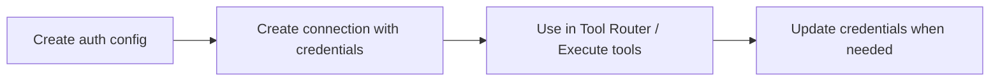

If your users have already authenticated with a service and you have their credentials (API keys, bearer tokens, etc.), you can pass those directly into Composio. No re-authentication required.

This is useful when:
- Your app already stores API keys or tokens for users
- You're adopting Composio and want to onboard existing users without disrupting them
- You want to use bearer tokens with OAuth toolkits (Gmail, GitHub, Slack, etc.) without setting up an OAuth app

## How it works



## Prerequisites

1. **An [auth config](/docs/auth-configuration/programmatic-auth-configs)** for the toolkit you're importing into
2. **The existing credentials** for each user (API keys, bearer tokens, username/password, etc.)
3. **A user ID** for each user — any string that uniquely identifies them in your system

## API keys

For services that use API key authentication (e.g., SendGrid, Tavily, PostHog):

<Tabs groupId="language" items={['Python', 'TypeScript']} persist>
<Tab value="Python">
```python
from composio import Composio
from composio.types import auth_scheme

composio = Composio(api_key="your-api-key")

connection = composio.connected_accounts.initiate(
    user_id="user_123",
    auth_config_id="ac_your_auth_config",
    config=auth_scheme.api_key({
        "api_key": "sg-existing-sendgrid-key",
    }),
)

# API key connections are immediately active
print(f"Connected: {connection.id}")
```
</Tab>
<Tab value="TypeScript">
```typescript
// @noErrors
import { Composio, AuthScheme } from '@composio/core';

const composio = new Composio({ apiKey: 'your-api-key' });

const connection = await composio.connectedAccounts.initiate(
  'user_123',
  'ac_your_auth_config',
  {
    config: AuthScheme.APIKey({
      api_key: 'sg-existing-sendgrid-key',
    }),
  }
);

// API key connections are immediately active
console.log('Connected:', connection.id);
```
</Tab>
</Tabs>

## Bearer tokens

If you manage your own OAuth flow and already have an access token for a service, you can import it into Composio as a bearer token. This lets you bring existing OAuth connections into Composio without re-authenticating your users. It works with **all toolkits that support OAuth2 or S2S auth** — Gmail, GitHub, Slack, Google Docs, and more. Any additional parameters the toolkit supports (e.g., `subdomain`, `base_url`) work the same way.

Since you're providing your own token, Composio won't handle OAuth refresh — you're responsible for refreshing the token on your end and pushing the updated value to Composio via the [PATCH method](#updating-credentials) whenever it changes.

After [creating an auth config](/docs/auth-configuration/programmatic-auth-configs) with `authScheme: "BEARER_TOKEN"`, use the snippet below to create a connected account:

<Tabs groupId="language" items={['Python', 'TypeScript']} persist>
<Tab value="Python">
```python
from composio import Composio
from composio.types import auth_scheme

composio = Composio(api_key="your-api-key")

connection = composio.connected_accounts.initiate(
    user_id="user_123",
    auth_config_id="ac_your_auth_config",
    config=auth_scheme.bearer_token({
        "token": "existing-bearer-token",
    }),
)

# Bearer token connections are immediately active
print(f"Connected: {connection.id}")
```
</Tab>
<Tab value="TypeScript">
```typescript
// @noErrors
import { Composio, AuthScheme } from '@composio/core';

const composio = new Composio({ apiKey: 'your-api-key' });

const connection = await composio.connectedAccounts.initiate(
  'user_123',
  'ac_your_auth_config',
  {
    config: AuthScheme.BearerToken({
      token: 'existing-bearer-token',
    }),
  }
);

// Bearer token connections are immediately active
console.log('Connected:', connection.id);
```
</Tab>
</Tabs>

## Basic auth

<Tabs groupId="language" items={['Python', 'TypeScript']} persist>
<Tab value="Python">
```python
from composio import Composio
from composio.types import auth_scheme

composio = Composio(api_key="your-api-key")

connection = composio.connected_accounts.initiate(
    user_id="user_123",
    auth_config_id="ac_your_auth_config",
    config=auth_scheme.basic({
        "username": "user@example.com",
        "password": "existing-password",
    }),
)

# Basic auth connections are immediately active
print(f"Connected: {connection.id}")
```
</Tab>
<Tab value="TypeScript">
```typescript
// @noErrors
import { Composio, AuthScheme } from '@composio/core';

const composio = new Composio({ apiKey: 'your-api-key' });

const connection = await composio.connectedAccounts.initiate(
  'user_123',
  'ac_your_auth_config',
  {
    config: AuthScheme.Basic({
      username: 'user@example.com',
      password: 'existing-password',
    }),
  }
);

// Basic auth connections are immediately active
console.log('Connected:', connection.id);
```
</Tab>
</Tabs>

## Updating credentials

When credentials expire or rotate, update them in place without recreating the connection. Fields you omit are preserved. Fields set to `null` are removed.

<Tabs groupId="auth-scheme" items={['Bearer token', 'API key', 'Basic auth']} persist>
<Tab value="Bearer token">
<Tabs groupId="language" items={['Python', 'TypeScript', 'curl']} persist>
<Tab value="Python">
```python
composio.connected_accounts.update(
    "ca_your_connection_id",
    connection={
        "state": {
            "authScheme": "BEARER_TOKEN",
            "val": {"token": "new-access-token"},
        },
    },
)
```
</Tab>
<Tab value="TypeScript">
```typescript
// @noErrors
import { Composio } from '@composio/core';
const composio = new Composio({ apiKey: 'your-api-key' });
// ---cut---
await composio.connectedAccounts.update('ca_your_connection_id', {
  connection: {
    state: {
      authScheme: 'BEARER_TOKEN',
      val: { token: 'new-access-token' },
    },
  },
});
```
</Tab>
<Tab value="curl">
```bash
curl -X PATCH https://backend.composio.dev/api/v3.1/connected_accounts/ca_xxx \
  -H 'x-api-key: YOUR_API_KEY' \
  -H 'Content-Type: application/json' \
  -d '{"connection":{"state":{"authScheme":"BEARER_TOKEN","val":{"token":"new-access-token"}}}}'
```
</Tab>
</Tabs>
</Tab>
<Tab value="API key">
<Tabs groupId="language" items={['Python', 'TypeScript', 'curl']} persist>
<Tab value="Python">
```python
composio.connected_accounts.update(
    "ca_your_connection_id",
    connection={
        "state": {
            "authScheme": "API_KEY",
            "val": {"generic_api_key": "new-api-key"},
        },
    },
)
```
</Tab>
<Tab value="TypeScript">
```typescript
// @noErrors
import { Composio } from '@composio/core';
const composio = new Composio({ apiKey: 'your-api-key' });
// ---cut---
await composio.connectedAccounts.update('ca_your_connection_id', {
  connection: {
    state: {
      authScheme: 'API_KEY',
      val: { generic_api_key: 'new-api-key' },
    },
  },
});
```
</Tab>
<Tab value="curl">
```bash
curl -X PATCH https://backend.composio.dev/api/v3.1/connected_accounts/ca_xxx \
  -H 'x-api-key: YOUR_API_KEY' \
  -H 'Content-Type: application/json' \
  -d '{"connection":{"state":{"authScheme":"API_KEY","val":{"generic_api_key":"new-api-key"}}}}'
```
</Tab>
</Tabs>
</Tab>
<Tab value="Basic auth">
<Tabs groupId="language" items={['Python', 'TypeScript', 'curl']} persist>
<Tab value="Python">
```python
composio.connected_accounts.update(
    "ca_your_connection_id",
    connection={
        "state": {
            "authScheme": "BASIC",
            "val": {"username": "user@example.com", "password": "new-password"},
        },
    },
)
```
</Tab>
<Tab value="TypeScript">
```typescript
// @noErrors
import { Composio } from '@composio/core';
const composio = new Composio({ apiKey: 'your-api-key' });
// ---cut---
await composio.connectedAccounts.update('ca_your_connection_id', {
  connection: {
    state: {
      authScheme: 'BASIC',
      val: { username: 'user@example.com', password: 'new-password' },
    },
  },
});
```
</Tab>
<Tab value="curl">
```bash
curl -X PATCH https://backend.composio.dev/api/v3.1/connected_accounts/ca_xxx \
  -H 'x-api-key: YOUR_API_KEY' \
  -H 'Content-Type: application/json' \
  -d '{"connection":{"state":{"authScheme":"BASIC","val":{"username":"user@example.com","password":"new-password"}}}}'
```
</Tab>
</Tabs>
</Tab>
</Tabs>

## Using in your session

Pass the auth config or connection ID when creating a session:

<Tabs groupId="language" items={['Python', 'TypeScript']} persist>
<Tab value="Python">
```python
session = composio.create(
    "user_123",
    auth_configs={"gmail": "ac_your_auth_config"},
    toolkits=["gmail"],
)
```
</Tab>
<Tab value="TypeScript">
```typescript
// @noErrors
import { Composio } from '@composio/core';
const composio = new Composio({ apiKey: 'your-api-key' });
// ---cut---
const session = await composio.create('user_123', {
  authConfigs: { gmail: 'ac_your_auth_config' },
  toolkits: ['gmail'],
});
```
</Tab>
</Tabs>

## What to read next

<Cards>
  <Card icon={<Key />} title="Custom auth configs" href="/docs/using-custom-auth-configuration" description="Set up auth configs with your own OAuth credentials" />
  <Card icon={<Database />} title="Connected accounts" href="/docs/auth-configuration/connected-accounts" description="Manage connected accounts after importing" />
  <Card icon={<Palette />} title="White-labeling" href="/docs/white-labeling-authentication" description="Use your own branding on OAuth consent screens" />
</Cards>
