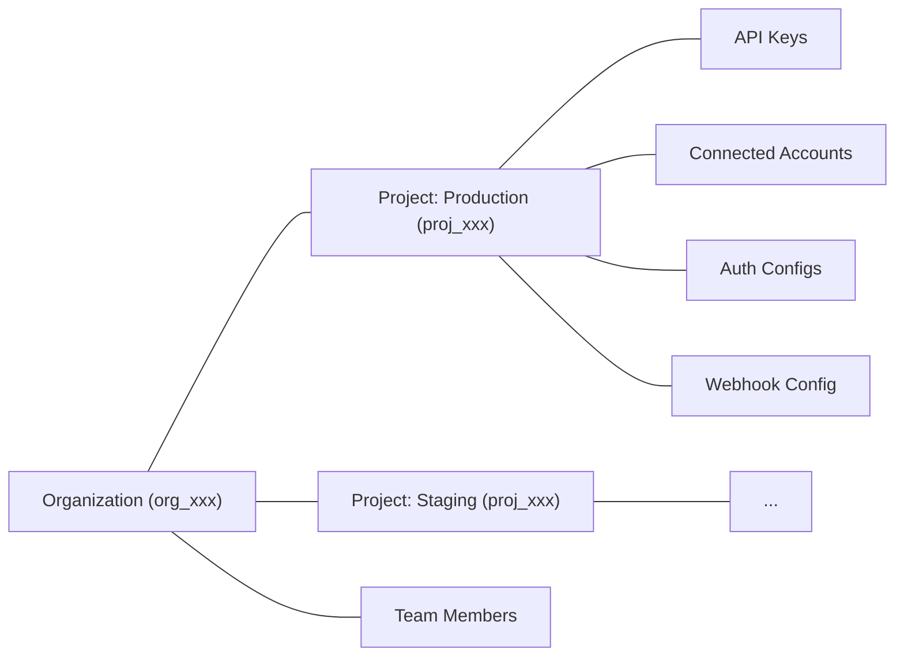

Projects are Composio's multi-tenancy primitive. Every Composio account belongs to an **organization**. Inside an organization, **projects** are isolated environments that scope your API keys, connected accounts, auth configs, and webhook configurations. Resources in one project are not accessible from another.



Common reasons to use multiple projects:
- **Separate environments**: keep production and staging isolated
- **Separate products**: keep resources for different apps independent
- **Client isolation**: give each client their own project with separate credentials and data

## Managing projects

You can manage projects from the [dashboard](https://dashboard.composio.dev/~/org/) or via the API using an **organization API key** (`x-org-api-key`).

<Callout type="info">
Project management endpoints use the `x-org-api-key` header, not the regular `x-api-key`. You can find your org API key in the dashboard under **Settings > Organization**.
</Callout>

### Create a project

There is no limit on the number of projects per organization. Project names must be unique within the organization.

```bash
curl -X POST https://backend.composio.dev/api/v3.1/org/owner/project/new \
  -H "x-org-api-key: YOUR_ORG_API_KEY" \
  -H "Content-Type: application/json" \
  -d '{
    "name": "my-staging-project",
    "should_create_api_key": true
  }'
```

The response includes the project ID and, if requested, an API key:

```json
{
  "id": "proj_abc123xyz456",
  "name": "my-staging-project",
  "api_key": "ak_abc123xyz456"
}
```

### List projects

```bash
curl https://backend.composio.dev/api/v3.1/org/owner/project/list \
  -H "x-org-api-key: YOUR_ORG_API_KEY"
```

Supports pagination with `limit` and `cursor` query parameters.

### Get project details

```bash
curl https://backend.composio.dev/api/v3.1/org/owner/project/proj_abc123xyz456 \
  -H "x-org-api-key: YOUR_ORG_API_KEY"
```

Returns the full project object including its API keys.

## Project settings

Each project has settings that control security, logging, and display behavior. These endpoints use your **project API key** (`x-api-key`), not the org key.

```bash
curl -X PATCH https://backend.composio.dev/api/v3.1/org/project/config \
  -H "x-api-key: YOUR_API_KEY" \
  -H "Content-Type: application/json" \
  -d '{
    "mask_secret_keys_in_connected_account": false,
    "log_visibility_setting": "show_all"
  }'
```

Notable security setting:
- `require_mcp_api_key`: when `true`, MCP server requests must include a valid `x-api-key` header. This defaults to `true` for organizations created on or after March 5, 2026.

You can also view and update these from **Settings > Project Settings** in the [dashboard](https://dashboard.composio.dev/~/project/settings/general). See the [Projects API reference](/reference/api-reference/projects) for all available settings.

## What to read next

<Cards>
  <Card icon={<Key />} title="Authentication" href="/docs/authentication" description="Auth configs are scoped to projects — learn how Composio manages auth" />
  <Card icon={<Database />} title="What is a session?" href="/docs/how-composio-works" description="Connected accounts and sessions live within a project" />
  <Card icon={<Zap />} title="Triggers" href="/docs/triggers" description="Webhook configurations are project-scoped" />
</Cards>
