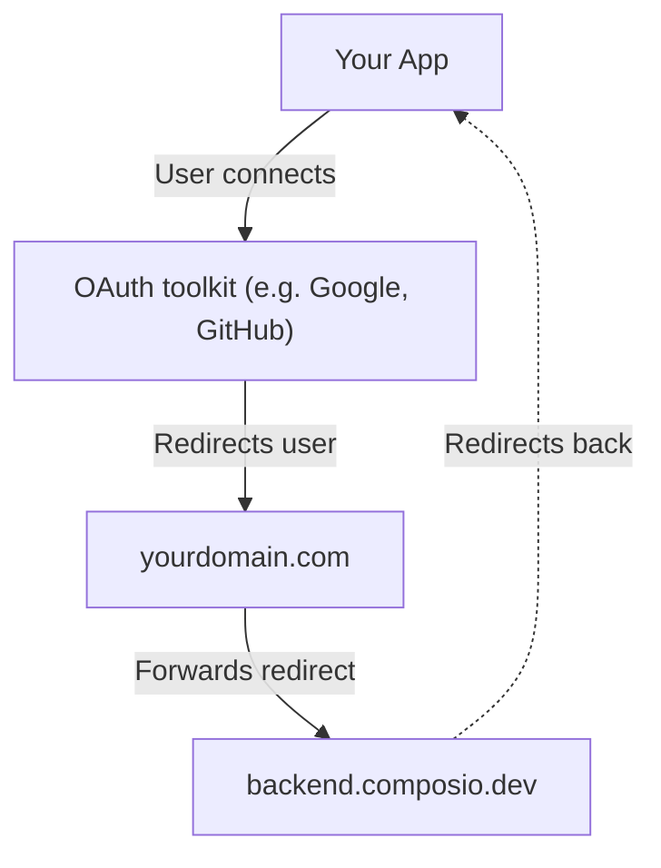

There are four places where Composio branding shows up during authentication:

| Where | What users see | How to fix |
|-------|---------------|------------|
| [**Connect Link page**](#customizing-the-connect-link) | Composio logo and name on the hosted auth page | Change logo + app title in dashboard |
| [**OAuth consent screen**](#using-your-own-oauth-apps) | "Composio wants to access your account" on Google, GitHub, etc. | Use your own OAuth app |
| [**Browser address bar**](#routing-the-callback-through-your-domain) | `backend.composio.dev` flashes during OAuth redirect-back | Proxy the redirect through your domain |
| [**Post-auth success page**](#redirecting-users-after-authentication) | Composio-branded success page after OAuth completes | Pass a `callbackUrl` when initiating the connection |

## Customizing the Connect Link

The Connect Link is the hosted page your users see when connecting their accounts. By default it shows Composio branding.

<Video src="/videos/connect-link-branding.mp4" autoPlay />

To replace it with your own branding:

1. Go to **Project Settings** → [**Auth Screen**](https://platform.composio.dev?next_page=/settings/auth-screen)
2. Upload your **Logo** and set your **App Title**

This applies to all Connect Link flows across all toolkits, for both [in-chat](/docs/authenticating-users/in-chat-authentication) and [manual](/docs/authenticating-users/manually-authenticating) authentication. Each project has one logo and app title, so if you need different branding per product, use separate projects.

<Callout>
Customizing the Connect Link only changes the Composio-hosted page. For OAuth toolkits like Gmail, Google Sheets, GitHub, and Slack, users still see a consent screen saying "Composio wants to access your account." To change that, and to remove the "Secured by Composio" badge, set up your own OAuth app as described [below](#using-your-own-oauth-apps).
</Callout>

<Callout type="warn" title="Troubleshooting">
- **"Secured by Composio" badge won't go away:** This badge is removed when you use your own OAuth app. See [Using your own OAuth apps](#using-your-own-oauth-apps).
- **Logo doesn't appear after uploading:** Clear browser cache or try incognito.
- **Upload fails with "failed to fetch":** Retry or use a smaller image.
</Callout>

## Using your own OAuth apps

OAuth toolkits like Google and GitHub show a consent screen that says which app is requesting access. By default this reads "Composio wants to connect to your account." To show your app name instead, register your own OAuth app and tell Composio to use it. This is done by creating a [custom auth config](/docs/using-custom-auth-configuration) with your own credentials. See [when to use your own OAuth apps](#when-to-use-your-own-oauth-apps).

<Callout type="info" title="You don't need this for every toolkit">
Only white-label toolkits where users see a consent screen (Google, GitHub, Slack, etc.). Toolkits that use API keys don't show consent screens, so there's nothing to white-label. You can mix and match freely.
</Callout>

<Steps>
<Step>
<StepTitle>Create an OAuth app in the toolkit's developer portal</StepTitle>

Register a new OAuth app with the toolkit. Set the callback URL to:

```
https://backend.composio.dev/api/v3.1/toolkits/auth/callback
```

You'll get a **Client ID** and **Client Secret**.

Step-by-step guides: [Google](https://composio.dev/auth/googleapps) | [Slack](https://composio.dev/auth/slack) | [HubSpot](https://composio.dev/auth/hubspot) | [All toolkits](https://composio.dev/auth)
</Step>

<Step>
<StepTitle>Create an auth config in Composio</StepTitle>

In the [Composio dashboard](https://platform.composio.dev):

1. Go to **Authentication management** → **Create Auth Config**
2. Select the toolkit (e.g., GitHub)
3. Choose **OAuth2** scheme
4. Toggle on **Use your own developer credentials**
5. Enter your **Client ID** and **Client Secret**
6. Click **Create**

Copy the auth config ID (e.g., `ac_1234abcd`).

</Step>

<Step>
<StepTitle>Pass the auth config ID in your session</StepTitle>

Specify which toolkits should use your custom auth config. Any toolkit you don't specify here will use Composio's managed auth automatically:

<Tabs groupId="language" items={['Python', 'TypeScript']} persist>
<Tab value="Python">
```python
session = composio.create(
    user_id="user_123",
    auth_configs={
        "github": "ac_your_github_config",
        "slack": "ac_your_slack_config",
        # gmail, linear, etc. use Composio managed auth automatically
    },
)
```
</Tab>
<Tab value="TypeScript">
```typescript
import { Composio } from '@composio/core';
const composio = new Composio({ apiKey: 'your_api_key' });
// ---cut---
const session = await composio.create("user_123", {
  authConfigs: {
    github: "ac_your_github_config",
    slack: "ac_your_slack_config",
    // gmail, linear, etc. use Composio managed auth automatically
  },
});
```
</Tab>
</Tabs>

Now when users connect GitHub or Slack, they'll see your app name on the consent screen. For Gmail and everything else, Composio's default app handles it.
</Step>
</Steps>

### When to use your own OAuth apps

- **Production apps** where end users see consent screens. They should see your brand, not Composio's.
- **Enterprise customers** who require your branding end-to-end.
- **Toolkits where you need custom scopes** beyond what Composio's default app provides.

For development and testing, Composio's managed auth works fine. No OAuth app setup required.

### Switching from Composio-managed to your own OAuth app

Existing connected accounts are permanently tied to the auth config they were created with. Switching to a custom auth config does not affect them. You have two options:

**Keep existing users as-is.** Just pass `authConfigs` for the toolkits you want to white-label. Users who already have a connection keep using it. Users who need to connect for the first time go through your OAuth app:

<Tabs groupId="language" items={['Python', 'TypeScript']} persist>
<Tab value="Python">
```python
session = composio.create(
    user_id="user_123",
    auth_configs={
        "github": "ac_your_github_config",  # new connections use your OAuth app
    },
)
# Existing GitHub connections for this user keep working as before.
# Only new connections go through your custom OAuth app.
```
</Tab>
<Tab value="TypeScript">
```typescript
import { Composio } from '@composio/core';
const composio = new Composio({ apiKey: 'your_api_key' });
// ---cut---
const session = await composio.create("user_123", {
  authConfigs: {
    github: "ac_your_github_config",  // new connections use your OAuth app
  },
});
// Existing GitHub connections for this user keep working as before.
// Only new connections go through your custom OAuth app.
```
</Tab>
</Tabs>

<Callout type="warn">
Existing users' connections continue using Composio's OAuth client credentials for token refresh until they re-authenticate.
</Callout>

**Fully migrate all users.** To move every user to your OAuth app, delete their old connected accounts and have them re-authenticate. There is no way to move an existing connection from one auth config to another without re-authentication.

## Routing the callback through your domain

During OAuth, the browser briefly redirects through `backend.composio.dev` so Composio can capture the auth token. Some toolkits also display this URL on the consent screen.

If you need to hide Composio's domain, you can proxy the redirect through your own domain instead.

<Steps>
<Step>
<StepTitle>Set the redirect URI to your domain</StepTitle>

In your OAuth app's settings, set the authorized redirect URI to your own endpoint:

```
https://yourdomain.com/api/composio-redirect
```
</Step>

<Step>
<StepTitle>Create a proxy endpoint</StepTitle>

This endpoint receives the OAuth callback and immediately 302-redirects it to Composio:

<Tabs groupId="language" items={['Python', 'TypeScript']} persist>
<Tab value="Python">
```python
from fastapi import FastAPI, Request
from fastapi.responses import RedirectResponse

app = FastAPI()

@app.get("/api/composio-redirect")
def composio_redirect(request: Request):
    composio_url = "https://backend.composio.dev/api/v3.1/toolkits/auth/callback"
    return RedirectResponse(url=f"{composio_url}?{request.url.query}")
```
</Tab>
<Tab value="TypeScript">
```typescript
// pages/api/composio-redirect.ts (Next.js)
import type { NextApiRequest, NextApiResponse } from "next";

export default function handler(req: NextApiRequest, res: NextApiResponse) {
  const composioUrl = "https://backend.composio.dev/api/v3.1/toolkits/auth/callback";
  const params = new URLSearchParams(req.query as Record<string, string>);
  res.redirect(302, `${composioUrl}?${params.toString()}`);
}
```
</Tab>
</Tabs>

<Callout type="warn">
Your endpoint must return a **302 redirect**. Do not follow the redirect server-side or make a fetch call to Composio. The user's browser needs to be redirected so the OAuth flow completes correctly.
</Callout>
</Step>

<Step>
<StepTitle>Update your auth config</StepTitle>

In the Composio dashboard, update your auth config to use your custom redirect URI.

<Figure src="/images/custom-redirect-uri.png" alt="Auth Config Settings" caption="Setting the custom redirect URI in your auth config" size="sm" />
</Step>
</Steps>

Here's how the redirect flow works. Your proxy just forwards the browser redirect to Composio. It never touches the authorization code or token.



<Callout type="info">
For FAQs and setup guides for individual toolkits, browse the [toolkits page](/toolkits).
</Callout>

## Redirecting users after authentication

By default, after OAuth completes, users land on a Composio-hosted success page that shows Composio branding. To bypass this page and send users to your own domain instead, pass a `callbackUrl` when calling `session.authorize()`:

<Tabs groupId="language" items={['Python', 'TypeScript']} persist>
<Tab value="Python">
```python
connection_request = session.authorize(
    "gmail",
    callback_url="https://your-app.com/callback"
)
```
</Tab>
<Tab value="TypeScript">
```typescript
import { Composio } from '@composio/core';
const composio = new Composio({ apiKey: 'your_api_key' });
const session = await composio.create("user_123");
// ---cut---
const connectionRequest = await session.authorize("gmail", {
  callbackUrl: "https://your-app.com/callback",
});
```
</Tab>
</Tabs>

After authentication, Composio redirects the user to your callback URL instead of the default success page. For full details on the parameters appended to your callback URL, see [Manually authenticating users → Redirecting users after authentication](/docs/authenticating-users/manually-authenticating#redirecting-users-after-authentication).

## What to read next

<Cards>
  <Card icon={<Key />} title="Using custom auth configuration" href="/docs/using-custom-auth-configuration" description="Set up auth configs for toolkits that don't have Composio managed authentication" />
  <Card icon={<Key />} title="Authentication overview" href="/docs/authentication" description="Connect Links, OAuth, API keys, and how Composio manages auth" />
</Cards>
