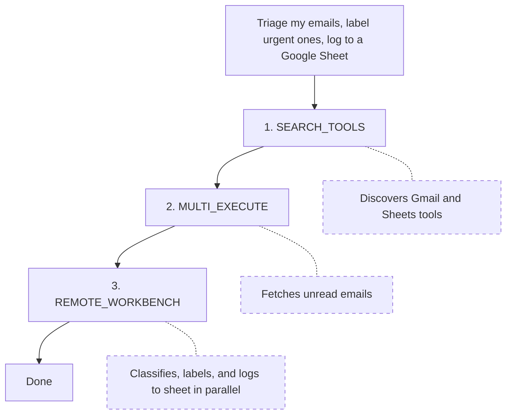

The workbench is a persistent Python sandbox where your agent can write and execute code. It has access to all Composio tools programmatically, plus helper functions for calling LLMs, uploading files, and making API requests. State persists across calls within a [session](/docs/how-composio-works). The `COMPOSIO_REMOTE_BASH_TOOL` meta tool also runs commands in the same sandbox.

<Callout>
The workbench is part of the [meta tools](/docs/tools-and-toolkits#meta-tools) system. It's available when you create sessions, not when [executing tools directly](/docs/tools-direct/executing-tools).
</Callout>

## Where it fits

Your agent starts with [`SEARCH_TOOLS` to find the right tools, then uses `MULTI_EXECUTE`](/docs/tools-and-toolkits#meta-tools) for straightforward calls. When the task involves bulk operations, data transformations, or multi-step logic, the agent uses `COMPOSIO_REMOTE_WORKBENCH` instead.

## What the sandbox provides

### Built-in helpers

These functions are pre-initialized in every sandbox:

| Helper | What it does |
|--------|-------------|
| `run_composio_tool` | Execute any Composio tool (e.g., `GMAIL_SEND_EMAIL`, `SLACK_SEND_MESSAGE`) and get structured results |
| `invoke_llm` | Call an LLM for classification, summarization, content generation, or data extraction |
| `upload_local_file` | Upload generated files (reports, CSVs, images) to cloud storage and get a download URL |
| `proxy_execute` | Make direct API calls to connected services when no pre-built tool exists |
| `web_search` | Search the web and return results for research or data enrichment |
| `smart_file_extract` | Extract text from PDFs, images, and other file formats in the sandbox |

### Libraries

Common packages like pandas, numpy, matplotlib, Pillow, PyTorch, and reportlab are pre-installed. Beyond these, the workbench maintains a list of supported packages and their dependencies. If the agent uses a package that isn't already installed, the workbench attempts to install it automatically.

### Error correction

The workbench corrects common mistakes in the code your agent generates. For example, if a script accesses `result["apiKey"]` but the actual field name is `api_key`, the workbench resolves the mismatch instead of failing.

### Persistent state

The sandbox runs as a persistent Jupyter notebook. Variables, imports, files, and in-memory state from one call are available in the next.

### Compute tier

Sandboxes default to `standard` (1 vCPU / 1 GB RAM). For heavier workloads — large dataframes, ML preprocessing, big bulk operations — pick a larger tier when creating the session via `workbench.sandboxSize` (TypeScript) / `workbench.sandbox_size` (Python). Available tiers: `standard`, `medium` (2 vCPU / 2 GB), `large` (4 vCPU / 4 GB), `xlarge` (8 vCPU / 8 GB). Requires `@composio/core` ≥ `0.8.1` or `composio` ≥ `0.12.1`. See [Configuring Sessions → Sandbox compute tier](/docs/configuring-sessions#sandbox-compute-tier) for examples.

<Callout type="info">
**Pricing:** Sandboxes are not billed today. Composio plans to begin billing for sandbox usage soon (metered by tier and runtime).
</Callout>

## Common patterns

### Bulk operations across apps

Some tasks touch hundreds of items across services. Say you need to triage 150 unread emails. The agent writes a workbench script: classify each email with `invoke_llm`, apply Gmail labels with `run_composio_tool`, and log results to a Google sheet.

### Data analysis and reporting

The agent can chain tools inside the sandbox. Fetch GitHub activity, aggregate with pandas, chart with matplotlib, summarize with `invoke_llm`, upload a PDF with `upload_local_file`.

### Multi-step workflows

The sandbox preserves variables and files across calls. The agent can paginate through records, transform them, and write to a destination over multiple calls.

## What to read next

<Cards>
  <Card icon={<Database />} title="What is a session?" href="/docs/how-composio-works" description="How sessions scope tools, auth, and workbench state to a user" />
  <Card icon={<Wrench />} title="Tools and toolkits" href="/docs/tools-and-toolkits" description="How meta tools discover, authenticate, and execute tools at runtime" />
  <Card icon={<Zap />} title="Triggers" href="/docs/triggers" description="Event-driven payloads from connected apps" />
</Cards>
